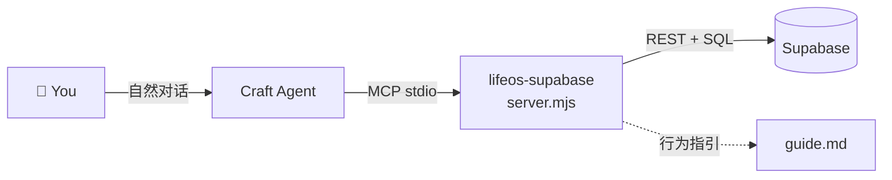

# LifeOS Craft Agent

A personal life management setup for [Craft Agent](https://craft.do) — a unified MCP source that lets you naturally manage expenses, notes, reminders, tasks, groceries, contacts, and more through conversation.



## What's Included

A single MCP source — **LifeOS Supabase** — that covers both your personal life and finances, plus a behavioral guide (`guide.md`) that teaches the agent to respond naturally as your 生活小管家 (little life steward).

| Category | Tools | What you manage |
|----------|-------|-----------------|
| **💸 Expenses** | 6 tools | Spending, purchases, bills, subscriptions, refunds, payment methods |
| **📋 Personal** | 5 tools | Notes, reminders, tasks, events, groceries, contacts, journal entries |
| **⚙️ System** | 1 tool | One-time database table creation |

---

## How to Use

Talk to the agent naturally — it understands context and routes your words to the right tools automatically. Here's what you can say:

### 💸 Expenses

| You say | What happens |
|---------|-------------|
| 「午餐 RM18 用 TNG eWallet」 | Auto-recorded — no confirmation needed |
| 「这个月花了多少？」 | Searches all expenses this month, gives a summary |
| 「上星期 Grab 那些一共多少？」 | Filters by keyword + date range |
| 「刚才那笔 Shopee 不是 RM58，是 RM56.50」 | Creates a corrected version, keeps the old one in history |
| 「Delete 那个 Grab 的，重复记了」 | Soft-deletes the expense, asks why and records the reason |
| 「收到 RM20 refund 那个 Shopee order」 | Updates the amount, appends a refund remark |
| *Share a receipt screenshot* | Parses merchant / items / amounts → asks you to confirm → saves |

**Payment methods** are auto-normalized: `TNG` → `Touch 'n Go eWallet`, `Shopee PayLater` → `SPayLater`, etc. If it's a PayLater method, the agent gently reminds you to settle before month-end.

**Corrections are never destructive.** Every update creates a new record linked to the original — your full change history is always there via `get_expense_history`.

### 📋 Personal Entries

| You say | What happens |
|---------|-------------|
| 「提醒我下星期五晚上打给妈妈」 | Resolves the date, creates a reminder |
| 「记进小本本：3月20号跟妈妈吃晚餐，3月18号先买菜」 | One entry with two attached dates |
| 「查看小本本」 | Searches your personal entries |
| 「晚餐改去7点半了」 | Finds the entry → appends a remark → updates the time |
| 「今天开了个会，讨论 Q2 roadmap」 | Saves as a journal/log entry |
| 「帮我记一下：Miko 的地址是…」 | Saves as a contact note |

**Entry types:** `note` · `task` · `reminder` · `event` · `idea` · `journal` · `grocery` · `contact` · `other`

**Past entries become logs.** If all dates on an entry are in the past, the agent treats it as a completed record — it won't remind you again. Only future-dated entries trigger reminders.

### 🔀 Combined

| You say | What happens |
|---------|-------------|
| 「今天午餐 RM12，然后提醒我明天交 report」 | Records the expense + creates a task — all in one go |

The agent uses both sets of tools when your message contains both life-context and expense content.

### 🗣️ "小本本" Triggers

Say these to **record**: 「记进小本本」「放进小本本」「帮我记一笔到小本本」

Say these to **search**: 「查看小本本」「翻小本本」「看看小本本」「这个月花多少」「有这笔吗」

When you trigger a search, the agent always checks the database — it never relies on chat memory alone. If nothing is found, it tells you honestly: 「我翻了翻小本本，好像没找到耶～」

---

## Language & Tone

The agent speaks like a warm Malaysian friend — relaxed, grounded, a little playful. Expect expressions like 「啦～」「咯～」「呀～」「好棒💪」「记好啦💕」 and emoji (😊💸✨😉).

- Defaults to your chat language (English / 中文 / Bahasa / mix)
- Brand names stay intact: `ShopeePay`, `SPayLater`, `Touch 'n Go eWallet`, `RM`
- Never sounds formal, technical, or preachy

---

## Tools Reference

### Expense Tools

| Tool | What it does | Required fields |
|------|-------------|-----------------|
| `record_expense` | Log a new expense | `total_amount`, `merchant_name`, `items`, `payment_method` |
| `search_expenses` | Search by keyword, date, payment, category | none (all optional) |
| `update_expense` | Correct a record (creates new version, soft-deletes old) | `id` |
| `delete_expense` | Soft-delete | `id` |
| `add_expense_remark` | Append a follow-up note | `id`, `text` |
| `get_expense_history` | View correction chain (oldest → newest) | `id` |

### Personal Tools

| Tool | What it does | Required fields |
|------|-------------|-----------------|
| `record_personal` | Create a new entry with optional dates & remarks | `raw_input` |
| `search_personal` | Search by keyword, type, status, date range | none (all optional) |
| `update_personal` | Edit an existing entry | `id` |
| `delete_personal` | Soft-delete | `id` |
| `add_personal_remark` | Append a follow-up note | `id`, `text` |

### System

| Tool | What it does |
|------|-------------|
| `ensure_tables` | Create tables, indexes, triggers, and views — run once during setup |

---

## Prerequisites

- **Node.js** v18+
- **Supabase** project with a database
- **[Craft Agent](https://craft.do)** desktop app

## Setup

1. Go to your Supabase dashboard → **Project Settings → API**. Copy the **Project URL** and **anon key**.
2. Open this project folder in Craft Agent and provide the URL and key when prompted.
3. Craft Agent will update `sources/lifeos-supabase/config.json`:
   - Set `mcp.args` to the absolute path of `server.mjs` on your machine
   - Set `SUPABASE_URL` and `SUPABASE_KEY` to your project values
4. Craft Agent will run `ensure_tables` to check if the database tables exist. If they do, setup is done. If not, it creates them automatically.
5. Done! Start chatting — try 「午餐 RM15 cash」 to test.

## Folder Structure

```
LifeOS Craft Agent/
├── README.md                          ← This file
├── 02-table.sql                       ← Reference SQL schema (also built into server.mjs)
├── docs/                              ← Documentation (extend as needed)
├── skills/                            ← Project-level skills (extend as needed)
└── sources/
    └── lifeos-supabase/
        ├── config.json                ← MCP transport config (URL, key, server path)
        ├── guide.md                   ← Full behavioral guide for the agent (~400 lines)
        ├── permissions.json           ← Explore-mode tool allowlist
        └── server.mjs                 ← MCP server — all 12 tools in ~900 lines
```

## How It Works

The MCP server (`server.mjs`) is a Node.js process that Craft Agent spawns as a local stdio subprocess. When you chat, the agent calls tools on this server, which talks to Supabase via its REST API (PostgREST) and SQL endpoint.

| Concept | Detail |
|---------|--------|
| **Timestamps** | Stored as UTC in the database. The server resolves your local timezone when reading and writing. |
| **Soft deletes** | Nothing is ever permanently removed — records are marked `deleted_at`. Undelete is not yet supported. |
| **Correction chains** | `update_expense` creates a new record linked via `correction_of`, soft-deletes the old one. Full history always accessible with `get_expense_history`. |
| **Multiple dates** | Personal entries can have multiple `date_entries` (e.g., prep date + event date). Search matches across all of them. |
| **Full-text search** | Expenses have a `tsvector` search column built from merchant name, items, payment method, and remarks. Categories are filterable. |
| **Auto PayLater detection** | The server infers `is_paylater` from the payment method name (e.g., `SPayLater`, `Grab PayLater`, `Atome`). |
| **Metadata linking** | Every personal entry captures `people`, `location`, `purpose`, entities, mood, and cross-references to related records and expenses — turning flat entries into a connected knowledge graph. |
| **Behavioral guide** | `guide.md` is the source of truth for how the agent should behave — tone, routing, time handling, receipt parsing, refunds, metadata extraction, and more. Read it to understand the full operating concept. |

## License

MIT
